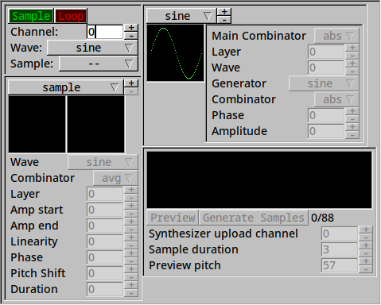

# Synthesis Playground

i wrote this to play around with PCM audio synthesis.  it's written in Lua 5.4.

Dependencies:
  - [moonal](https://github.com/stetre/moonal)
  - `midialsa`
  - `lanes`
  - `luaposix`
  - `moonfltk`

## Usage

`lua main.lua ALSA_DEVICE`

`ALSA_DEVICE` is a MIDI device specifier, e.g. `20:0` or `"Digital Piano"`.

On launch you should be presented with a window like this one.

## Performance

the synthesizer included here runs well on my laptop with an older i7.  it should run on anything reasonably modern.
