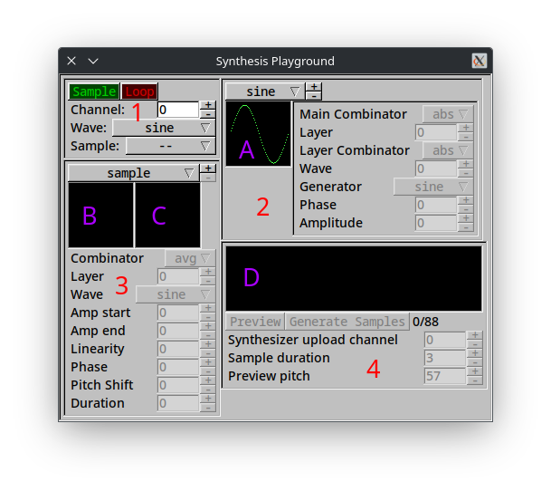

# Synthesis Playground GUI

This document provides basic usage information for the Synthesis Playground GUI.

On launch you should be presented with a window like this one.

This window is divided into four sections:
  (1) Synthesizer controls
  (2) Wave editor
  (3) Sample editor
  (4) Sample upload controls

## Synthesizer Controls
The built-in synthesizer is fairly basic and currently only supports playback from a MIDI keyboard specified on launch.  This should change in the future.

The Green `Sampler` indicator brightens when the current channel is configured to use samples.  The red `Loop` indicator brightens when the loop pedal is pressed on the MIDI keyboard.  _Looper functionality is not yet implemented._

The "Channel" input specifies which channel the keyboard should pass through, and is relevant for the two dropdown menus.

The "Wave" menu allows you to select a wave used for synthesis.  This is useful for rapidly prototyping simpler sounds that are just layered waves, as the wave profile is regenerated every time a new note sounds.  Waves created in the wave generator section of the GUI are available here too.

The "Sample" menu allows you to select a created sample set for the synthesizer to use.  If the synthesizer does not yet have a cached version of the sample set, it will generate one.

## Wave Generator
Synthesis Playground comes with a built-in wave generator that allows you to layer the four basic included wave types - sine, square, triangle, and sawtooth - in various ways.  It is structured in two dimensions - each wave generator has one or more layers, each of which is made up of some number of waves.

A new wave generator can be created by clicking the "+" button next to the wave selector drop-down above preview A.  There is currently no way to rename these.

Preview A displays one cycle of the currently selected wave.

The `Main Combinator` drop-down specifies which combinator to use when combining layers.  The `Layer` field specifies which layer to edit.  The `Wave` field specifies which wave to edit.  The `Layer Combinator` drop-down specifies which combinator to use to combine the current layer.

The rest of the controls are used to modify the current wave: `Generator` controls which of the default generators to use; `Phase` controls the offset of the wave phase; `Amplitude` controls the amplitude of the wave.

## Sample Editor
This section of the interface allows you to create sample profiles, used to generate more complex sounds than the real-time wave generator is capable of.

Create a new sample by clicking the `+` button at the top right of the sample editor section.

The `Combinator` control functions similarly to that in the wave editor; that is, it specifies which combinator to use to combine all the layers of the sample.  The `Layer` control specifies which layer of the sample to edit.

The `Wave` control specifies which wave to use in the current layer.  This control allows selection of custom waves created in the Wave Editor.

The `Amp start`, `Amp end`, and `Linearity` fields specify the starting and ending amplitudes of the current layer, and how linear the transition is.  This is graphed in preview B as all layers superimposed.  Preview C shows all waves from all layers superimposed.  Preview D shows the waveform of 16 cycles of the final output waveform.

The `Phase` control sets the wave's phase offset, like in the Wave Editor.  The `Pitch Shift` control shifts the pitch of the wave up or down by the given number of semitones.  The `Duration` control sets how long the current wave will last as a percentage of the whole sample duration.

## Sample Upload Controls
This section contains preview D as well as some other controls related to previewing and uploading of samples.

The `Preview` button plays a preview of the sample at the pitch specified by the `Preview pitch` control.  All generated samples will be generated at the length specified byt the `Sample duration` control.

The `Generate Samples` button generates 88 samples from pitches 21 to 100 and uploads them to the synthesizer at the channel specified by the `Synthesizer upload channel` control.

### Combinator Functions
Wave combinators are used to combine multiple waves into one.  There are currently three:
  - `max`, which is just `math.max`;
  - `abs`, which is similar to `max` but compares absolute values;
  - `avg`, which returns the average value;
